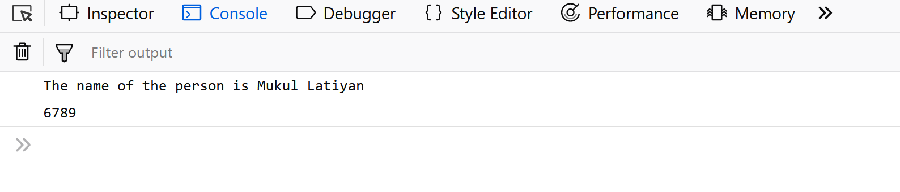

**Tutorial: Implementing Object-Oriented Principles in JavaScript** <br>
                  By: Allison Eglow

In this tutorial, we will be exploring how Object-Oriented Programming (OOP) is implemented in JavaScript. 

Object-oriented programming is a programming paradigm that uses abstraction to create models 
based on the real world. 

There are certain features that make a Language Object Oriented like:
<li>Object
<li>Classes
<li>Encapsulation
<li>Inheritance

**Object**

 An Object is a unique entity which contains property and methods.The characteristics of an Object are called as Property, 
 in Object Oriented Programming and the actions are called methods.
 
 ```
//Defining object 
  let person = { 
      first_name:'Mukul', 
      last_name: 'Latiyan', 
    
      //method 
      getFunction : function(){ 
          return (`The name of the person is  
            ${person.first_name} ${person.last_name}`) 
      }, 
      //object within object 
      phone_number : { 
          mobile:'12345', 
          landline:'6789'
      } 
  } 
  console.log(person.getFunction());  
  console.log(person.phone_number.landline); `

```

 </img>

**Classes**


**Encapsulation**


**Inheritance**


[](https://coveralls.io/github/ae324/calculator?branch=master)
[](https://travis-ci.org/ae324/calculator)
