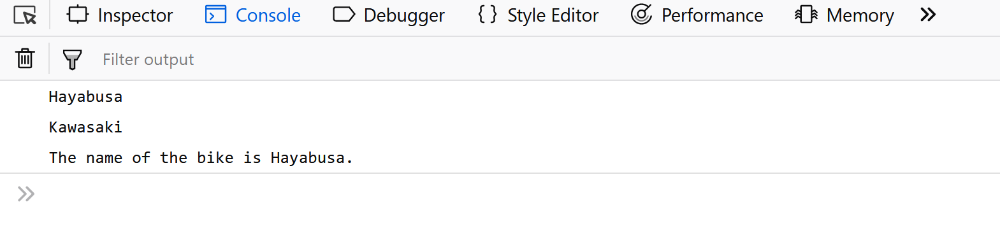
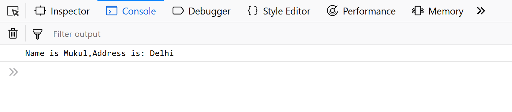
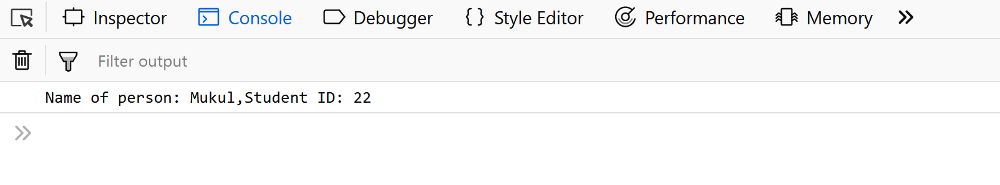

[](https://coveralls.io/github/ae324/calculator?branch=master)
[](https://travis-ci.org/ae324/calculator)

**Tutorial: Implementing Object-Oriented Principles in JavaScript** <br>
                  By: Allison Eglow

In this tutorial, we will be exploring how Object-Oriented Programming (OOP) is implemented in JavaScript. 

Object-oriented programming is a programming paradigm that uses abstraction to create models 
based on the real world. 

There are certain features that make a **Language Object Oriented** like:
<li>Object
<li>Classes
<li>Encapsulation
<li>Inheritance


**1. Object-** An Object is a **unique** entity which contains **property** and methods.The characteristics of an Object are called as Property, 
 in Object Oriented Programming and the actions are called methods.
  
  There are three different ways for an Object to be created in JavaScript:
 <li> Using an Object Literal:

 ```
//Defining object 
  let person = { 
      first_name:'Mukul', 
      last_name: 'Latiyan', 
    
      //method 
      getFunction : function(){ 
          return (`The name of the person is  
            ${person.first_name} ${person.last_name}`) 
      }, 
      //object within object 
      phone_number : { 
          mobile:'12345', 
          landline:'6789'
      } 
  } 
  console.log(person.getFunction());  
  console.log(person.phone_number.landline); `

```
Output:
 </img>

<li> Using an Object Constructor:

```
//using a constructor 
function person(first_name,last_name){ 
   this.first_name = first_name; 
   this.last_name = last_name; 
} 
//creating new instances of person object 
let person1 = new person('Mukul','Latiyan'); 
let person2 = new person('Rahul','Avasthi'); 
  
console.log(person1.first_name); 
console.log(`${person2.first_name} ${person2.last_name}`); 
```

Output:
 </img>

<li>Using Object.create() method: The Object.create() method creates a new object, using an existing object as the prototype of the newly created object.

```
// Object.create() example a 
// simple object with some properties 
const coder = { 
    isStudying : false, 
    printIntroduction : function(){ 
        console.log(`My name is ${this.name}. Am I  
          studying?: ${this.isStudying}.`) 
    } 
} 
// Object.create() method 
const me = Object.create(coder); 
  
// "name" is a property set on "me", but not on "coder" 
me.name = 'Mukul';  
  
// Inherited properties can be overwritten 
me.isStudying = 'True';  
  
me.printIntroduction();  
```
Output:
 </img>

<br>

**2. Classes-** Classes are blueprint of an Object. A class can have many Object, because class is a template while Object are instances of the class or the concrete implementation.
Let's understand classes with an example:

```
function Vehicle(name,maker,engine){ 
    this.name = name, 
    this.maker = maker, 
    this.engine = engine 
}; 
  
Vehicle.prototype.getDetails = function(){ 
    console.log('The name of the bike is '+ this.name); 
} 
  
let bike1 = new Vehicle('Hayabusa','Suzuki','1340cc'); 
let bike2 = new Vehicle('Ninja','Kawasaki','998cc'); 
  
console.log(bike1.name); 
console.log(bike2.maker); 
console.log(bike1.getDetails());
```
Output:


 </img>

In the above example we simply create an person Object using the constructor and Initialize it property and use it functions we are not bother about the implementation details. We are working with an Objects interface without considering the implementation details.

<br>

**3. Encapsulation**- The process of wrapping property and function within a single unit is known as encapsulation.

<br>Let’s understand encapsulation with an example.

```
class person{ 
    constructor(name,id){ 
        this.name = name; 
        this.id = id; 
    } 
    add_Address(add){ 
        this.add = add; 
    } 
    getDetails(){ 
        console.log(`Name is ${this.name},Address is: ${this.add}`); 
    } 
} 
  
let person1 = new person('Mukul',21); 
person1.add_Address('Delhi'); 
person1.getDetails(); 
```
Output:
 </img>


<br>

**4. Inheritance**- a concept in which some property and methods of an Object is being used by another Object.
<br>
Let's understand inheritance with an example:
```
class person{ 
    constructor(name){ 
        this.name = name; 
    } 
    //method to return the string 
    toString(){ 
        return (`Name of person: ${this.name}`); 
    } 
} 
class student extends person{ 
    constructor(name,id){ 
        //super keyword to for calling above class constructor 
        super(name); 
        this.id = id; 
    } 
    toString(){ 
        return (`${super.toString()},Student ID: ${this.id}`); 
    } 
} 
let student1 = new student('Mukul',22); 
console.log(student1.toString()); 
```
Output:
 </img>


In the above example we define an Person Object with certain property and method and then we inherit the Person Object in the Student Object and use all the property and method of person Object as well define certain property and methods for Student.
Note: The Person and Student object both have same method i.e toString(), this is called as Method Overriding. Method Overriding allows method in a child class to have the same name and method signature as that of a parent class.
In the above code, super keyword is used to refer immediate parent class instance variable.


<br>
